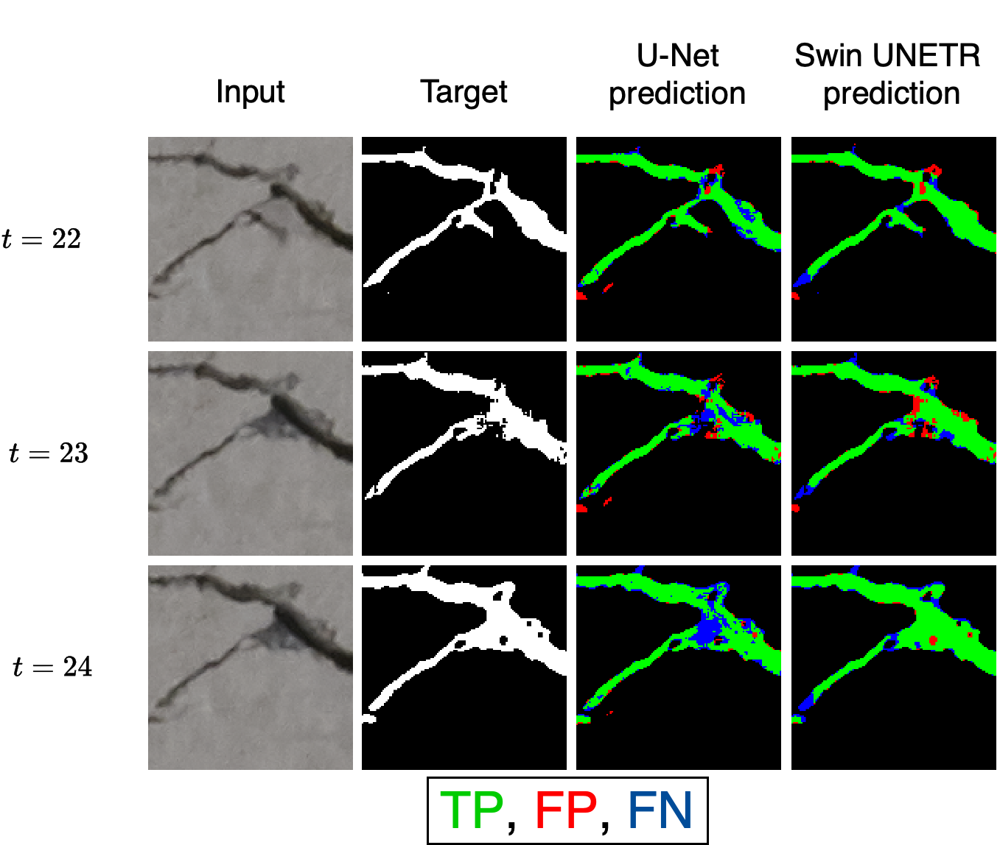

# Multi-temporal crack segmentation in concrete structures using deep learning approaches

## Abstract

This research investigates whether leveraging multi-temporal data for crack segmenta- tion can enhance segmentation quality. Cracks represent one of the earliest indicators of deterioration in concrete structures. Early automatic detection of these cracks can signif- icantly extend the lifespan of critical infrastructure such as bridges, buildings, and tun- nels, while simultaneously reducing maintenance costs and facilitating efficient structural health monitoring. The research compares a Swin UNETR trained on multi-temporal data with a U-Net trained on mono-temporal data to assess the effect of temporal information compared to conventional single-image approaches. To this end, a multi-temporal dataset comprising 1356 images, each with 32 sequential crack propagation images, was created. After training the models, experiments were conducted to analyze the generalization abil- ity, temporal consistency, and segmentation quality of both models. The multi-temporal approach consistently outperformed its mono-temporal counterpart, achieving an IoU of 82.72% and an F1-score of 90.54%, representing a significant improvement over the mono- temporal model’s IoU of 76.69% and F1-score of 86.18%, despite requiring only half the trainable parameters. Both models were further tested on a data-augmented test set sim- ulating environmental conditions, with the multi-temporal model again exhibiting su- perior performance and generalization ability. The multi-temporal model also displayed more consistent segmentation quality, with reduced noise and fewer errors. These results suggest that temporal information significantly enhances the performance of segmenta- tion models, offering a promising solution for improved crack detection and long-term monitoring of concrete structures, even with limited sequential data.

## Dataset
The dataset is available and hosted in this [GitHub repo](https://github.com/saidharb/Multi-Temporal-Crack-Segmentation-Dataset.git).

## Repository Structure
The code used in this work is split up into three directories within this repository. Refer to the README files in the directories for descriptions of the code.

- `models`: Contains the main code for the U-Net and the Swin UNETR
- `data creation`: Contains the code necessary to create the mono- and multi-temporal dataset
- `code`: Preliminary work on the Retina dataset for pretraining. The idea was discarded later and the code in this directory is not used for this work.
- `presentation`: This directory contains the slides created to track progress. Later the final presentation will be added here.
- `figures`: All figures are in the submission report and were not uploaded to GitHub.

